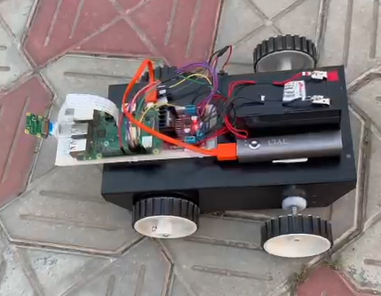

# Agriculture Cyber Physical Systems Project
## **Automated System for Weed Detection**

### Overview
The **Automated System for Weed Detection** is the perfect handshake between Artificial Intelligence (AI) and robotics. In this project, we utilized AI to perform early stage weed detection which enables the farmer to have better yield. The AI system is integrated on a Raspberry Pi which is fitted over a robot car chassis to perform the weed detection in the field.

This project is a significant step toward integrating **robotics**, **AI**, and **environmental conservation**.

### Key Features
- **Weed Detection**: Uses AI enabled image recognition via a mounted camera to differentiate between weeds and beneficial plants.
- **Acoustic Alert**: Once a weed is detected, a targeted sound alert is triggered.

### Components & Technologies Used
- **Robotic Platform**: A mobile robot equipped with a camera.
- **Fully Autonomous**: Robot is programmed to be fully autonomous and stops when a weed is detected.
- **Computer Vision**: Visual recognition powered by convolutional neural network models.
- **Acoustic System**: Trigger-based sound mechanism for alert notifications.

### Project Workflow
1. **Data Collection**: The robot scans the environment with its camera.
2. **Weed Identification**: Computer vision models analyze the captured images to detect weeds.
3. **Trigger Alert**: An acoustic alert is triggered upon weed detection, notifying the user.

### Visuals
#### Robot Prototype

  

#### Comprehensive System Overview

  

### Potential Applications
- Precision agriculture
- Yield Increment
- Early weed detection

### Future Development
- Enhanced AI model training
- Expanded sensor capabilities
- Integration with autonomous agricultural systems

### Acknowledgments
Created as part of the Agriculture Cyber Physical Systems course project, under the guidance of Dr. Neeraj Goel and Dr. Mukesh Saini, at the Indian Institute of Technology Ropar.
